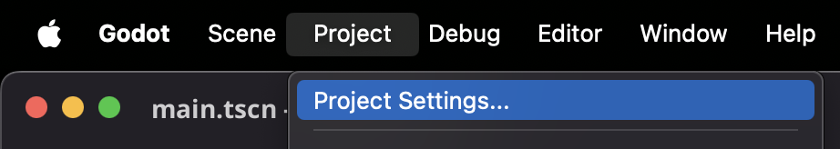
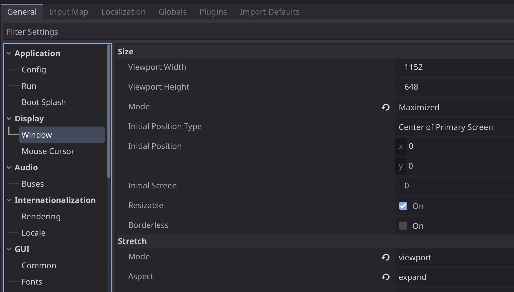
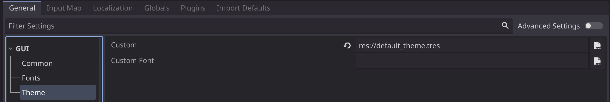

# Quickstart Godot 4.4

This project aims to be a ready-to-go base for a Godot project.

## Table of Content
- [Table of Content](#table-of-content)
- [Node Overview](#node-overview)
- [Project Configuration](#project-configuration)
  - [Display](#display)
  - [Theme](#theme)
  - [Globals](#globals)
  - [Translations](#translations)

## Node Overview

There is a couple of predefined building blocks:
- [Basic Control Node](base_nodes/basic_control.gd)
    - built in `Signal` handling
    - [Basic Control Node Template](script_templates/Control/basic_control_template.gd)
    - register one or multiple signals
- [Content Node](base_nodes/content_node.gd) (extends [Basic Control Node](base_nodes/basic_control.gd))
    - Clears it's content on `_ready()`
    - [Content Node Template](script_templates/Control/basic_control_template.gd)
- [Scene Manager](base_nodes/scene_manager_base.gd) Node (extends [Basic Control Node](base_nodes/basic_control.gd))
    - works together with `Content Node`
    - [Scene Manager Template](script_templates/Control/scene_manager_template.gd)
- [Signal Bus](autoloader/signal_bus.gd)
    - cebtral place for signals
- [default theme](default_theme.tres)
    - removes button white focus border
    - intended as project theme

## Project Configuration

### Display

### Theme

### Globals

### Translations
