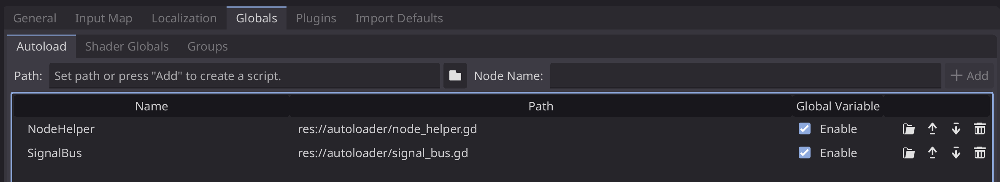

# Quickstart Godot 4.4

This project aims to be a ready-to-go base for a Godot project.

## Table of Content
- [Table of Content](#table-of-content)
- [Node Overview](#node-overview)
- [Project Configuration](#project-configuration)
  - [Display](#display)
  - [Theme](#theme)
  - [Globals](#globals)
  - [Translations](#translations)

## Node Overview

There is a couple of predefined building blocks:
- [Basic Control Node](base_nodes/basic_control.gd)
    - built in `Signal` handling
    - [Basic Control Node Template](script_templates/Control/basic_control_template.gd)
    - register one or multiple signals
- [Content Node](base_nodes/content_node.gd) (extends [Basic Control Node](base_nodes/basic_control.gd))
    - Clears it's content on `_ready()`
    - [Content Node Template](script_templates/Control/basic_control_template.gd)
- [Scene Manager](base_nodes/scene_manager_base.gd) Node (extends [Basic Control Node](base_nodes/basic_control.gd))
    - works together with `Content Node`
    - [Scene Manager Template](script_templates/Control/scene_manager_template.gd)
- [Signal Bus](autoloader/signal_bus.gd)
    - cebtral place for signals
- [default theme](default_theme.tres)
    - removes button white focus border
    - intended as project theme

## Project Configuration
The following topics are part of the `Project Setting` which you can find in the taskbar.

### Display

### Theme

#### Remove Default Button Focus
This has already been done in the [default theme](default_theme.tres), and is a instruction for new ones.
This also extends to other Control/UI elements where the focus highlight isnt desired.

1. create new `resource` of type `theme`.
2. open your created theme `.tres` file
3. select the `+` icon seen in the top right
4. Select `Button` (NO AUTOCOMPLETE)
5. select to second colored tab as shown below
6. locate `focus` and click `+`
7. select `New StyleBoxEmpty`


### Globals

### Translations
Godot will translates the `text` property by default, like used in buttons as labels.

### Setup Project Translations
1. Add [new translations here](Translations/translations.csv)
2. Switch to Godot to trigger resource import
   1. This creates *.translation files from [CSV](Translations/translations.csv)
3. Add translation file in project settings


#### Set & Use Locale Language in Code
You can use the translation key to tell the `TranslationServer` which translation file to look up.
To use a translation from the registered keys use the `tr()` method Godot provides.
```gdscript
TranslationServer.set_locale('en')
var translation = tr('QUIT_APP')
```

#### Translations File Format
Godot interprets the first column as lookup key, each other next column key is treated as a translation for that locale.

> It is recommended to use keys following a pattern that incorporates more information where they are used.

Format to Follow:
```CSV
key,language_one,language_two
QUIT_APP,Quit App,App Beenden
QUIT_GAME,Quit Game,Spiel Beenden
```
